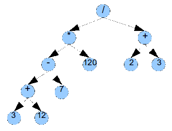

# Expression Trees

Expression trees are a type of binary tree that can be used to store print and evaluate mathematical expresssions.

## Goals:
The goal of this assignment is to implement an expression tree, practice working with binary trees, and design good class inheritance.

## Requirements:
For this assignment, you will implement at least two classes: *BinaryTree* and *ExpressionTree*.  The *BinaryTree* class should be a generic (templated) binary tree class.  The *ExpressionTree* class should extend (through inheritance) the *BinaryTree<String> class.  You will be graded not only on passing the test cases but also on proper use of encapsulation, access specification, inheritance, and const. As you design your classes, think about what functionality is specific to ExpressionTree (setting an expression for example) and what functionality is general to all Binary Trees. The ExpressionTree class will need to be able to parse a mathematical expression, load it into a binary tree, print the expression in Postfix or Infix notation, and evaluate the expression.

### BinaryTree class

+ Must be templated
+ Should support generic binary tree methods (especially those used by an expression tree)
+ Proper use of friends, const, private, protected and public

### ExpressionTree class

+ Must inherit from BinaryTree<String> class
+ Must support the following public methods:
	+ ExpressionTree() - default constructor creates an empty expression tree
	+ ExpressionTree(std::string expr) - Creates an expression tree from the given string expression
	+ setExpression(std::string expr) - Clears the expression tree and stores the given expression in the tree
	+ getResult() - return the results of evaluating the expression tree
	+ printParseTreeInOrder(std::ostream&) - outputs the tree to the ostream& using an in-order traversal
	+ printParseTreePostOrder(std::ostream&) - outputs the tree to the ostream& using post-order traversal

## Parsing Building and Evaluating ExpressionTrees

The core of this assignment revolves around taking a statement like: __((((3+12)-7)*120)/(2+3))__ and converting it into a tree like this: 

Building the expression tree can be done recursively like follows:
+ If the character is a '(' create a node and place it on the left of your currentNode, move to the next character in the expression and recursively go left from the currentNode.
+ if the character is a digit, continue reading from the string until you encounter a non-digit character.  Each time concatenate the new digit character into a temporary string.  Store that temp string in your currentNode data and then return.
+ If the character is an operator store the operator in the currentNode data, create a new node and place it on the right of your currentNode, move to the next character in the expression and recursively go right from the currentNode.
+ if the character is a ')', just return.

Evaluating the expression tree can also be done recursively like follows:
+ If the node is null the result is 0.0
+ If the node is a number the result is that number
+ If the node is an operator the result is the recursive result of the left subtree and right subtree combined using the given operator

## Helpful Hints:

To convert a string to a number you can write your own method, use the atof method in the cstdlib header or use the C++11 stod method found in the string header

You can use the isdigit method found in the cctype header to check if a char is a digit or you can write your own method.

To compute an exponent such as A^B you need to use pow(A, B) which is found in the cmath header file.

You may want to write an isOperator method.

Note that this assigment uses binary trees and expression trees, NOT binary search trees.
